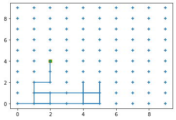
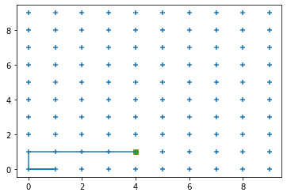

# 💡 ActiveBlockference

This is a work-in-progress repository for active inference agents in cadCAD.

Active Blockference is an open source project that will be stewarded through deep time by the Active Inference Institute.
Reduce your uncertainty about how to participate in Active Inference Institute or contact us: https://activeinference.org/ 

## 🚧 Getting Started

```
# clone the repo

git clone https://github.com/ActiveInferenceInstitute/ActiveBlockference.git

cd ActiveBlockference/

# create new python environment

python -m venv cad

# activate the environment

source cad/bin/activate

# install requirements

pip install -r requirements.txt
```


## Developing Active Inference Agents in cadCAD

An active inference agent consists of the following matrices:
- $A$ - the generative model's prior beliefs about how hidden states relate to observations
- $B$ - the generative model's prior beliefs about controllable transitions between hidden states over time
- $C$ - the biased generative model's prior preference for particular observations encoded in terms of probabilities
- $D$ - the generative model's prior belief over hidden states at the first timestep

### pymdp ~ Active Inference
#### Analysis of actinf_from_scratch pymdp tutorial

The pymdp inference loop has the following steps (for more information visit the official [tutorial](https://pymdp-rtd.readthedocs.io/en/latest/notebooks/active_inference_from_scratch.html)):
- initialize prior to the D matrix
- get observation index from `grid_locations`
- (q_s) perform inference over hidden states with `infer_states`, passing in the observation index, the A matrix, and the prior
- calculate expected free energy, passing in the A, B, C matrices, the inferences (q_s) from the previous step, and available actions
- compute action posterior (it's the softmax of -G)
- sample the action posterior the get the action
- compute the prior for next state with the dot product of the B matrix (indexed with the chosen action) and the current inference (q_s)

## Active Gridference

The example notebook available in notebooks/ contain active inference agents moving in a grid environment with the aim of finding a preferred location.

 
