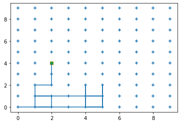
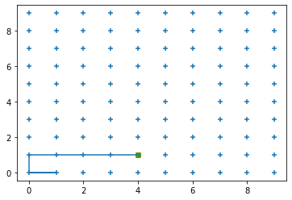

# ActiveBlockference

> **Active Inference agents in cadCAD** — discrete-state generative models for
> grid-world, multi-agent, and graph-structured environments, expressed as
> [cadCAD](https://github.com/cadCAD-org/cadCAD) / [radCAD](https://github.com/CADLabs/radCAD)
> partial-state-update blocks. Configurable. Validated. Visualised.

ActiveBlockference is an open-source library stewarded by the
[Active Inference Institute](https://activeinference.org/). It composes the
canonical Active Inference loop — *infer states → evaluate expected free
energy → sample action → propagate prior* — with cadCAD/radCAD generative
simulations, a typed config layer, an opinionated `output/` artefact tree,
and built-in visualisation + animation.

---

## Table of contents

1. [Why?](#why)
2. [Repository layout](#repository-layout)
3. [Quick start with `uv`](#quick-start-with-uv)
4. [The pipeline](#the-pipeline)
5. [Programmatic example](#programmatic-example)
6. [Documentation](#documentation)
7. [Testing & CI](#testing--ci)
8. [Contributing](#contributing)
9. [Citing](#citing)
10. [License](#license)

---

## Why?

[Active Inference](https://activeinference.org/) (AIF) gives a single,
principled imperative for action-perception loops: minimise (expected)
variational free energy. [cadCAD](https://cadcad.org/) is the de-facto
discrete-time generative-simulation framework for complex adaptive systems.

Expressing AIF agents as cadCAD policies lets us:

* Compose AIF agents with **non-AIF mechanisms** (markets, networks, queues).
* Run **Monte-Carlo sweeps** over generative-model hyperparameters.
* Inspect **belief dynamics, EFE proxies, and emergent collective behaviour**
  directly from cadCAD state history.

## Repository layout

```
ActiveBlockference/
├── README.md               — this file
├── AGENTS.md               — guide for AI / human contributors
├── LICENSE                 — MIT
├── pyproject.toml          — packaging + tooling config
├── requirements.txt        — runtime deps
├── requirements.lock       — `uv pip freeze` snapshot of a known-good env
│
├── blockference/           — installable Python package
│   ├── agent.py            — pymdp 1.x Agent extension hook
│   ├── maths.py            — self-contained AIF math primitives (no pymdp dep)
│   ├── gridference.py      — discrete grid generative model + step funcs
│   ├── pipeline.py         — composable run/persist/viz/validate pipeline
│   ├── logging_setup.py    — stdlib logging configuration + per-run file handler
│   ├── config/             — typed YAML/TOML experiment config
│   ├── envs/               — environment classes (single, multi-agent)
│   ├── io/                 — output layout, persistence, validation
│   ├── simulations/        — runnable cadCAD/radCAD experiments
│   ├── viz/                — static plots + animated GIFs
│   └── utils/              — math, mutual-info, cadCAD policy templates
│
├── configs/                — YAML/TOML experiment definitions
├── output/                 — generated artefacts (gitignored)
├── notebooks/              — exploratory + tutorial Jupyter notebooks
├── docs/                   — long-form theory + architecture docs
├── tests/                  — pytest unit + smoke + pipeline tests
├── GRTs/                   — Generative Research Team experiments (LangChain)
└── .github/workflows/ci.yml — uv-driven CI (ruff + pytest + smoke)
```

Every directory has its own `README.md` (what lives here) and `AGENTS.md`
(how to safely work here as an agent or contributor).

## Quick start with `uv`

```bash
# 1. Clone
git clone https://github.com/ActiveInferenceInstitute/ActiveBlockference.git
cd ActiveBlockference

# 2. Create a Python 3.11 virtualenv with uv
uv venv --python 3.11

# 3. Editable install with dev extras
uv pip install -e ".[dev,docs]"

# 4. Run the test suite (fast, no GPU)
uv run pytest

# 5. Run the full validated pipeline → output/gridworld_example/
uv run python -m blockference.simulations.grid_sim --pipeline configs/example.yml
```

Don't have `uv`? Install it with `curl -LsSf https://astral.sh/uv/install.sh | sh`
or `pipx install uv`.

## The pipeline

A single command runs the whole flow against a YAML config:

```bash
uv run python -m blockference.simulations.grid_sim --pipeline configs/example.yml
```

Produces (under `output/<run_name>/`):

```
output/gridworld_example/
├── config.yml                          ← copy of the config that produced this run
├── run.log                             ← structured per-run log (timestamps, decisions, validation)
├── data/
│   ├── trajectory.csv                  ← cadCAD result frame
│   ├── trajectory.parquet              ← (when pyarrow available)
│   ├── summary.json                    ← n_agents, final positions, …
│   ├── generative_model.json           ← A/B/C/D/E for every agent (full matrices)
│   ├── per_step.csv                    ← per-(agent, t) action / posterior / EFE proxy
│   └── policies.json                   ← enumerated policy set
├── viz/
│   ├── trajectory.png                  ← agent paths on the grid
│   ├── action_distribution.png         ← per-agent action histogram
│   ├── efe_proxy.png                   ← belief-entropy trace (EFE proxy)
│   ├── belief_heatmap_first.png        ← q(s) at t=0
│   └── belief_heatmap_last.png         ← q(s) at the final step
├── animations/
│   └── trajectory.gif                  ← animated path roll-out
└── validation_report.json              ← schema + math + artefact validation
```

Every step is composable:

```python
from blockference.pipeline import (
    run_pipeline,
    summarise_trajectory,
    render_visualisations,
)
from blockference.io import build_run_paths, validate_run_outputs
```

## Programmatic example

```python
from blockference import ActiveGridference, make_grid, run_pipeline, ExperimentConfig

# Build a config in code…
cfg = ExperimentConfig.from_dict({
    "name": "demo",
    "seed": 42,
    "grid": {"dimension": 3, "planning_length": 2},
    "simulation": {"timesteps": 10, "n_agents": 2, "target": "random"},
})
result = run_pipeline(cfg)            # → PipelineResult bundling df + paths + reports
print(result.paths.run_dir)
print(result.summary)
print(result.artefacts_report.to_dict())

# …or just a single-step inference loop:
grid  = make_grid(3, 2)
agent = ActiveGridference(grid)
agent.get_C((2, 2))
agent.get_D((0, 0))
```

For the full inference / planning step see
[`docs/architecture.md`](docs/architecture.md) and
[`tests/test_gridference.py`](tests/test_gridference.py).

## Documentation

* [`docs/theory.md`](docs/theory.md) — Active Inference primer (A, B, C, D, E).
* [`docs/architecture.md`](docs/architecture.md) — module-by-module map.
* [`docs/api.md`](docs/api.md) — public Python surface.
* [`docs/pipeline.md`](docs/pipeline.md) — config → pipeline → output flow.
* [`docs/tutorials/`](docs/tutorials/) — step-by-step notebooks → scripts.
* [`docs/glossary.md`](docs/glossary.md) — terminology cheatsheet.
* [`docs/contributing.md`](docs/contributing.md) — contributor guide.
* [`docs/development.md`](docs/development.md) — local dev with `uv`.

## Testing & CI

```bash
uv run pytest                                        # full suite
uv run pytest --cov=blockference --cov-report=term   # coverage
uv run ruff check blockference tests                 # lint
```

`.github/workflows/ci.yml` runs lint + tests + a real pipeline smoke run on
every PR across Python 3.10 / 3.11 / 3.12.

## Contributing

PRs welcome. The high-level conventions:

1. Touch tests when you touch source.
2. Run `uv run ruff check blockference tests` and `uv run pytest`.
3. New notebooks go in `notebooks/<topic>/`; promote stable code into
   `blockference/` with a test.
4. New configs go in `configs/`; the schema is in
   `blockference/config/experiment.py`.
5. See [`docs/contributing.md`](docs/contributing.md) for the full flow.

## Citing

```bibtex
@software{active_blockference,
  title  = {ActiveBlockference: Active Inference Agents in cadCAD},
  author = {{Active Inference Institute}},
  year   = {2026},
  url    = {https://github.com/ActiveInferenceInstitute/ActiveBlockference}
}
```

## License

[MIT](LICENSE).

 
