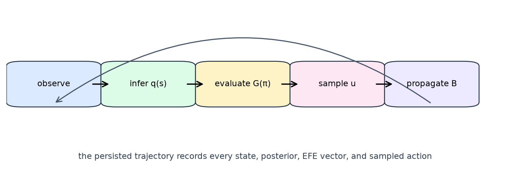

# Introduction {#sec:introduction}

Active Inference provides a normative account of perception and action in
which an agent maintains a generative model and selects actions that make
preferred future observations probable. The variational free-energy framing
connects Bayesian inference with action under uncertainty [@Friston2010]. The
discrete-state formulation makes this connection concrete through likelihood,
transition, preference, initial-state, and control-factor arrays
[@Sajid2021; @Heins2022].

ActiveBlockference addresses a narrower engineering question: how can a small
discrete Active Inference model be implemented so that its mathematical
objects, simulation dynamics, and published artefacts cannot silently diverge?
The answer is a deliberately explicit boundary between model and environment.
The model computes a distribution over actions. The environment applies the
chosen actions using one canonical transition implementation. The pipeline
then serializes both the inputs and all intermediate vectors needed to audit a
run.

{#fig:loop width=95%}

The scope is intentionally finite. The grid is a square, coordinates are
`(y, x)`, observations are grid locations, and the default affordance order is
`UP`, `DOWN`, `LEFT`, `RIGHT`, `STAY`. These choices make the model easy to
reason about while leaving room for configured affordance subsets and multiple
agents. The package is an executable reference for deterministic simulation
contracts, not a claim that a grid agent captures biological cognition.

The contributions are fourfold:

1. a typed and strict configuration boundary with unknown-key rejection;
2. one validated movement and collision semantics shared by model, simulation,
   notebooks, and visualisations;
3. fail-closed probability, trajectory, diagnostic, artefact, and rendering
   validation; and
4. a reproducible manuscript and figure build that is checked as part of the
   software release.

The remainder of the manuscript defines the state spaces and equations,
proves the transition properties used by the environment, maps the formal
objects to the code, reports the validation protocol, and records limitations
and reproducibility conditions.
