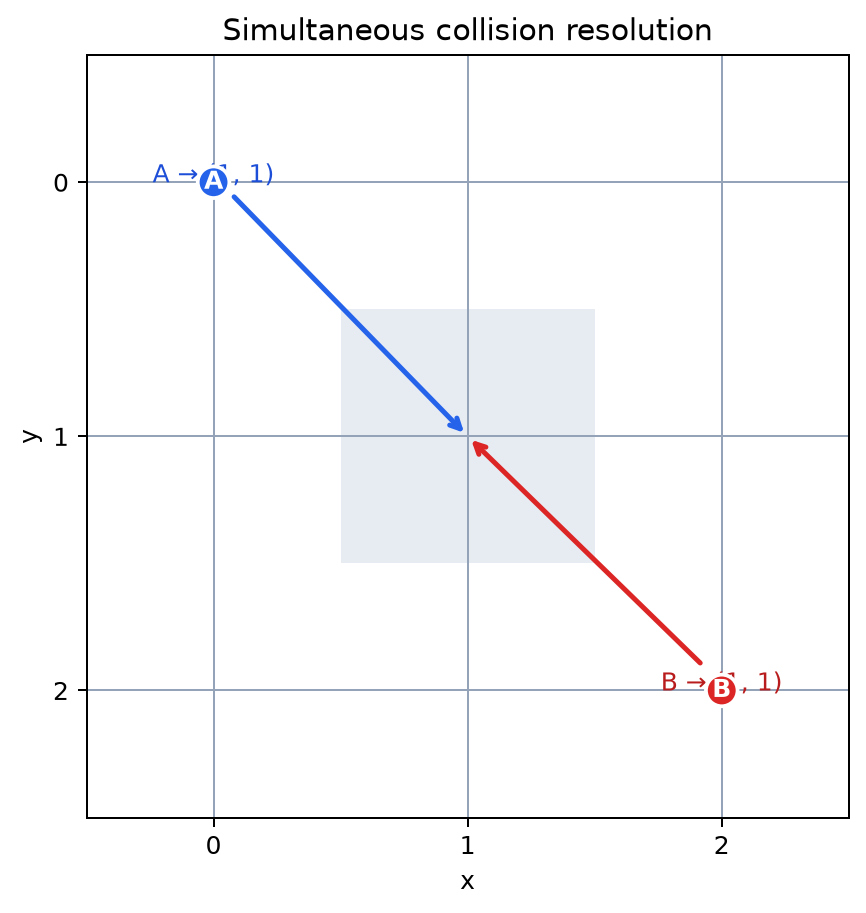

# Deterministic grid dynamics {#sec:dynamics}

## Single-agent transition

The canonical movement function accepts an action index, a `(y, x)` location,
the grid border, and the ordered affordances. Directional actions clamp at the
boundary; `STAY` leaves the location unchanged. The same function constructs
the `B` tensor and applies an environment action, so a model prediction and an
observed move use identical semantics.

::: definition {#def:canonical-transition}
**Canonical transition.** Let $T_u:S\to S$ map a valid coordinate to the
coordinate obtained by applying affordance $u$ and clamping it to the grid. The
transition tensor is $B_{s',s,u}=1$ exactly when $s'=T_u(s)$ and is zero
otherwise.
:::

::: proposition {#prop:transition-stochastic}
**Transition stochasticity.** For every valid source state and affordance,
exactly one destination is selected. Therefore every slice $B^{(u)}$ is
non-negative and column-stochastic.
:::

*Proof.* Action validation gives one valid label for the integer action index.
The coordinate is in the grid, and clamping returns one coordinate in the same
grid. The constructor writes one value equal to one in the destination row of
the source column and leaves the remaining entries zero. Thus each column has
sum one. $\square$

## Simultaneous multi-agent resolution

Single-agent transitions do not resolve interactions. `resolve_moves` first
computes every proposal from the same source state, then applies a deterministic
conflict rule. A target occupied at the beginning of the step remains
unavailable. A free target proposed by several agents is granted in deterministic
identifier order; later proposals remain at their source. This makes a swap a
pair of rejected moves and prevents an agent from moving through another agent
that is also moving.

{#fig:collision width=75%}

::: proposition {#prop:collision-determinism}
**Collision determinism.** For a fixed positions mapping, action mapping,
dimension, affordance order, and deterministic identifier order,
`resolve_moves` returns one unique next-position mapping independent of mapping
insertion order.
:::

*Proof.* Proposals are pure functions of the fixed inputs. The occupied set is
computed before any update. The resolver iterates over the total deterministic
identifier order, and each target is either rejected because it was initially
occupied, rejected because it was claimed, or assigned once. No later branch
can change an earlier assignment. Therefore the output is unique. $\square$

The rule is intentionally conservative. It favours auditability over a hidden
priority policy, and the tests exercise same-cell proposals, occupied targets,
boundaries, and simultaneous swaps.

## Executable algorithm

::: algorithm {#alg:inference-step}
**One simulation step.**

1. Read each agent's observed coordinate.
2. Infer $q_t(s)$ using `A` and the current prior.
3. Enumerate all policies over the configured affordances.
4. Evaluate $G(\pi)$ and derive $Q(\pi)$.
5. Marginalise the first policy action and sample one action.
6. Propagate the prior through the selected $B^{(u)}$ slice.
7. Resolve all environment proposals simultaneously.
8. If collision resolution rejects a proposal, replace that predicted prior
   with the one-hot prior at the realized coordinate.
9. Persist the posterior, prior, action, EFE vector, decomposition, and state.
:::

The graph and dictionary multi-agent paths call the same one-agent inference
step and then share the environment's deterministic interaction rule. This
prevents an integration backend from becoming a second behavioral model.
