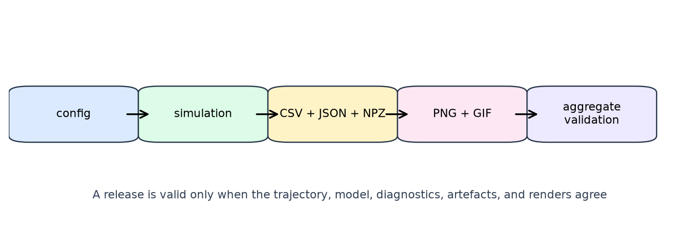

# Validation and artefact integrity {#sec:validation}

## Fail-closed numerical checks

Probability arrays are accepted only when they are finite, non-negative,
non-empty, shape-compatible, and normalised where the operation requires a
distribution. Transition slices and likelihood columns must sum to one. A
zero-sum array is not silently interpreted as a valid posterior; normalisation
uses a uniform value only for the explicitly documented zero-sum helper path.

::: definition {#def:validation-report}
**Aggregate validation report.** A report is the conjunction of named checks
over trajectory schema, model invariants, per-step diagnostics, required
artefacts, non-empty content, and rendered outputs. Its `ok` field is true if
and only if every check is true.
:::

The validator parses the on-disk values again. It rejects missing or malformed
trajectory columns, empty frames, invalid coordinates, missing diagnostic
vectors, inconsistent EFE decompositions, invalid stochastic matrices,
missing required files, invalid image/GIF signatures, and incomplete logs.
This second parse is important: a successful Python call is not evidence that
the files a researcher will receive are complete.

## Diagnostics as an audit trail

Every per-step record includes the state prior, environment coordinate, action,
posterior, observation index, policy EFE vector, epistemic and pragmatic
components, policy posterior, and action marginal. The decomposition is checked
elementwise:

$$
G(\pi) = G_{\mathrm{epistemic}}(\pi) + G_{\mathrm{pragmatic}}(\pi).
$$ {#eq:efe-decomposition}

The invariant in [@eq:efe-decomposition] makes it possible to distinguish an inference problem from a
transition problem, an action sampler problem, or a renderer problem without
re-running the experiment.

## Release verdict

{#fig:release-contract width=95%}

::: proposition {#prop:release-soundness}
**Release soundness.** If `PipelineResult.ok` is true, the pipeline has
observed a passing trajectory report, at least one passing model report,
passing per-step diagnostics, a passing complete artefact report, and at least
one visualisation and animation output.
:::

*Proof.* `PipelineResult.ok` delegates to the aggregate report. The aggregate
merges the trajectory, model, per-step, and artefact reports, adds an explicit
non-empty model check, and records each registered rendering output. The report
can become true only when each merged check and non-empty rendering check is
true. $\square$

The converse is intentionally useful: removing a required file or corrupting
a persisted vector makes the aggregate report false even if the in-memory
trajectory remains available.
