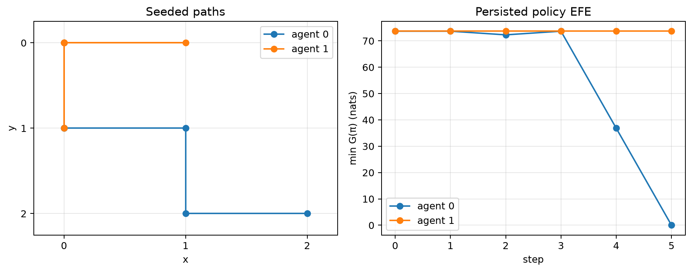

# Results and executable demonstrations {#sec:results}

## Seeded reference run

The reference figure is generated from the same package used by the pipeline.
It configures a $3\times3$ grid, two agents, a planning horizon of two, six
simulation timesteps, the five default affordances, and seed 17. No trajectory
values are transcribed by hand: `scripts/build_manuscript.py` invokes
`run_experiment`, extracts the returned coordinates and EFE vectors, and saves
the figure after closing the Matplotlib figure in a `finally` block.

{#fig:seeded-run width=95%}

The left panel in [@fig:seeded-run] shows the coordinate paths in the package's
`(y, x)` convention. The right panel uses the persisted policy EFE vectors and
plots the minimum value per agent and timestep. It is therefore a renderer of
the actual diagnostic object, not a proxy derived from action entropy.

| Parameter | Reference value |
|---|---|
| Backend | radCAD; cadCAD uses the same state-update contract |
| Grid | $3\times3$ |
| Agents | 2 |
| Planning length | 2 |
| Timesteps | 6 |
| Seed | 17 |
| Affordances | `UP`, `DOWN`, `LEFT`, `RIGHT`, `STAY` |

: Reference configuration used for the reproducible manuscript figure. {#tbl:reference-run}

## Backend and round-trip checks

The test suite runs both supported simulation engines, compares their schema
and seeded row-index fields, and repeats a seeded run to check trajectory
reproducibility. A complete pipeline test creates the full output tree,
reloads its trajectory, parses its model JSON and NPZ, verifies policies and
per-step diagnostics, checks raster and animation signatures, and evaluates
the aggregate report.

The negative controls are equally important. They exercise malformed CSV
columns and nested states, missing diagnostics, negative probabilities, invalid
coordinates, unknown configuration keys, unsafe output names, incomplete
render trees, and failed rendering artefacts. These cases must produce a false
verdict or an explicit exception; none is allowed to pass because a file exists.

## Affordance ablation

The affordance vocabulary is a model parameter. Removing `STAY` changes the
control dimension and policy count; reordering labels changes the meaning of an
action index; including an unsupported label fails configuration. Because the
same validated tuple feeds transition construction, policy enumeration,
simulation, action-distribution plots, and environment stepping, an affordance
ablation changes the full computation rather than only its legend.
