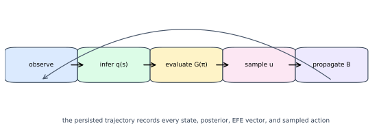

# Manuscript syntax

## Sections and formal objects

```markdown
# Methods {#sec:methods}

::: definition {#def:state-space}
**Discrete state space.** A finite set of states is ...
:::

$$
q_{t+1} = B^{(u_t)}q_t
$$ {#eq:state-propagation}
```

Supported formal labels are `eq`, `def`, `prop`, and `alg`. The builder emits
their type and number in source order and resolves a reference such as
`[@eq:state-propagation]` into the corresponding numbered object.

## Figures and tables

```markdown
{#fig:loop width=90%}

| Field | Meaning |
|---|---|
| `A` | likelihood |

: Core generative-model fields. {#tbl:model-fields}
```

Figure and table numbers are also assigned by source order. The image path is
relative to this directory and must exist when validation runs.

## Citations

Use BibTeX keys in square brackets:

```markdown
The discrete formulation is summarized by [@Sajid2021].
```

Do not write raw citation commands or raw equation cross-reference commands in
the source. `references.bib` is the only bibliography source.
